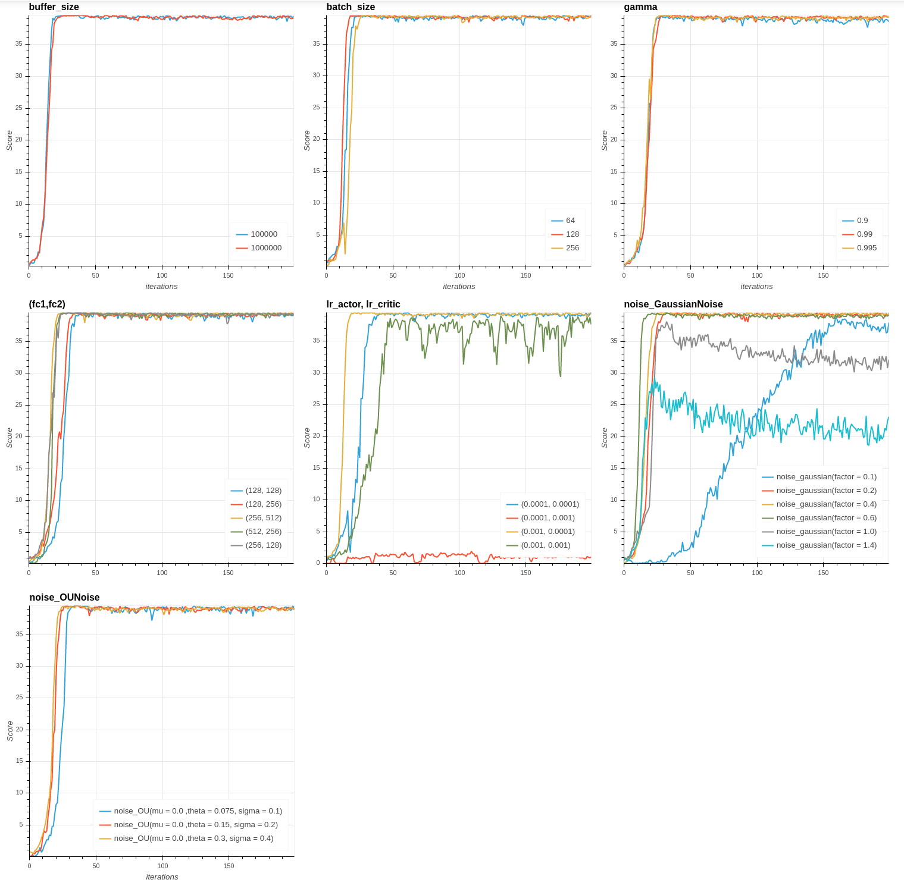
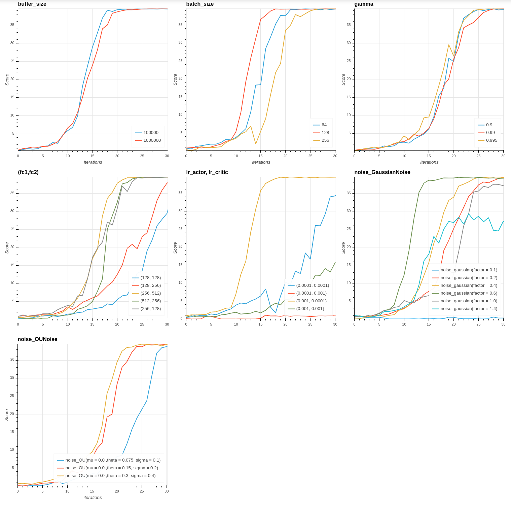
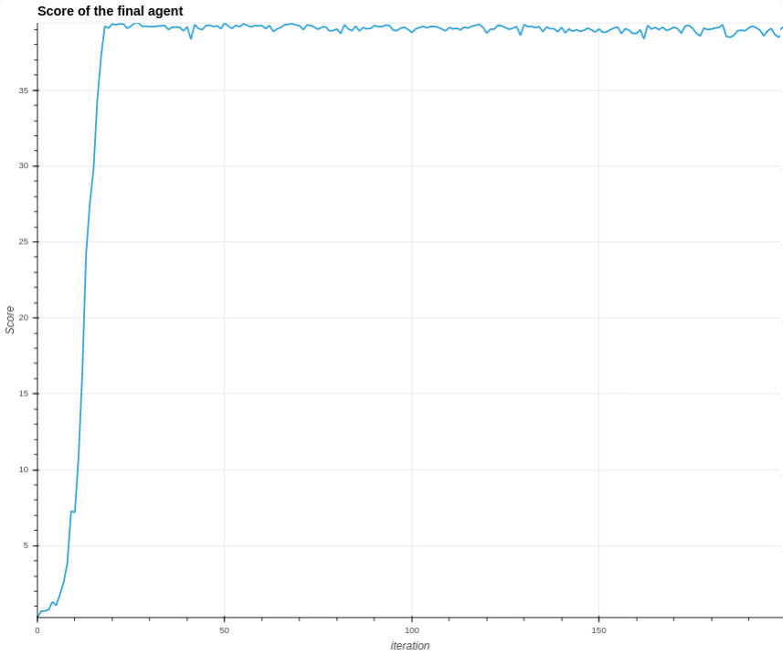

# Report Reacher

## Introduction

This project is part of the [Deep Reinforcerment Learning NanoDegree from Udacity](https://www.udacity.com/course/deep-reinforcement-learning-nanodegree--nd893) . The aim is to train an agent that manipulate a double-jointed arm that should move to a target location and maintain its position at the target as long as possible.

The project involves the Reacher environment from the [Unity Machine Learning Agents Toolkit (ML-Agents Toolkit)](https://github.com/Unity-Technologies/ml-agents). It is an open-source project from Unity that offers various environments for training intelligent agents. It is designed to ease the training of agents by defining environments that offer observations, actions and rewards.

The state space of the Reacher environment has 33 variables corresponding to position, rotation, velocity, and angular velocities of the arm. Contrary to the first project of the course (based on the Banana Collector environment), in Reacher, each action is a vector with four numbers, corresponding to torque applicable to two joints. Every entry in the action vector should be a number between -1 and 1.  

For this project, we have the choice between a single agent version and a multi-agent version. We proposed here a solution for the single agent version.

The Reacher task is episodic, and in order to solve the environment, our agent must get an average score of more than 30 over 100 consecutive episodes.

## Technical settings

As part of the Deep Reinforcement Learning course, this project reuses the source code offer by the course. Especially, it is derived from the following Deep Determinic Policy Gradient implementation : [ddpg-pendulum](https://github.com/udacity/deep-reinforcement-learning/tree/master/ddpg-pendulum). The agent has been trained locally using PyTorch with Cuda involving an *Intel core i7 7700HQ*, *16Gb RAM* and a *Nvidia GP107* GPU.

## Solution

The Reacher environment is solved using a DDPG (Deep Determinic Policy Gradient). Common reinforcement learning techniques as DQN could not be applied here since it only apply to discrete action spaces in the sense that it searches for the action that maximize the action value function at each iteration.

First, we tried to solve the environment using the code of the code from the course ( [ddpg-pendulum](https://github.com/udacity/deep-reinforcement-learning/tree/master/ddpg-pendulum)). At this stage, we implemented gradient clipping  when training the critic network, as suggested in the course. We obtained an agent have not been able to reach a good score.

We decided to switch to a multi-agents implementation using the 20 agents version provided.
In this version, our replay buffer stores experiences of all the 20 agents.
Each agent adds its experience to a replay buffer that is shared by all agents, and
the (local) actor and critic networks are updated once at every time step.

To improve the learning behavior of this agent, we choosed to investigate other aspects of our DDPG agent:

- **the hyperparameters** : We choosed to try to find the best values for the a set of impacting parameters.
- **the noise applied on the actor output to ease exploration** : The implementation from the course uses an Ornstein-Uhlenbeck process but we found that some papers (such as [Distributed Distributional Deterministic Policy Gradients](https://arxiv.org/pdf/1804.08617.pdf)) just suggests other noises like Gaussian noises.

We also read carefuly the [implementation of ShangtongZhang](https://github.com/ShangtongZhang/DeepRL) introduced in the course and found some tweaks like initializing the weights of the target networks with the same values as the local network.

## Parameterization

The DDPG algorithm introduces many parameters we can play on to speed up the convergence and the final score of the trained agent :

- **buffer_size** : The size of the replay buffer in the context of the *Experience replay*,
- **batch_size** : The size of the batch involved in the update enhanced using *Experience replay*,
- **gamma** : The discount factor involved in the rewards expectation,
- **(fc1, fc2)** : the size of the first and the second layer of the fully connected neural networks that are used for the actor and for the critic.
- **lr_actor** : the learning rate of the neural netowrk of the actor,
- **lr_critic** : the learning rate of the neural netowrk of the critic,
- **noise** : the noise applied on the actor output to ease exploration, we test different parameterizations of the Ornstein-Uhlenbeck process suggested in the course but also test different gaussian noises.

Setting the right values for these parameters is not obvious. We propose the following approach to find a good distribution of hyper parameters : We start with a mix of values that are close to those advised in the litterature and values we found usefull during our preliminary manual tests (for instance the noise) :

- **buffer_size** : 10000,
- **batch_size** : 128,
- **gamma** : 0.99,
- **(fc1, fc2)** : (512, 256),
- **lr_actor** : 0.001,
- **lr_critic** : 0.0001,
- **noise** : Gaussian distribution with mean 0 with standard deviation 0.4.

Since the training of the agent is time consuming, we chosed the following simple heuristic approach to find a good value for each hyper parameter. For each parameter, we introduce a list of values to test. Among those values, the one we keep is the one that leads to the fastest convergence.

More specificaly, we test the followings values :

- **buffer_size** : [10000, 100000]  (try to enlarge the buffer)
- **batch_size** : [64, 128] 
- **gamma** : [0.9, 0.99, 0.995] (test lower and higher discount rates)
- **(fc1, fc2)** : [(128, 128), (128, 256), (256, 512), (512, 256), (256, 128), (512, 256)] (test different networks. In first place, manual tests showed that layer sizes between 128 and 512 seems to fit well for this environment),
- **lr_actor, lr_critic** : [(1e-4, 1e-4), (1e-4, 1e-3), (1e-3, 1e-4), (1e-3, 1e-3)] (the litterature advises learning rates between 1e-3 and 1e-4, we test all the combinations here for the actor and the critic)
- **noise** : We test Gaussian distributions  with mean 0 and standard deviation in 0.1, 0.2, 0.4, 0.6, 1 and 1.4 and Ornstein-Uhlenbeck process with (theta, sigma) in {(0.075, 0.1), (0.15, 0.2), (0.3, 0.4)}.

When a value is "tested", we train a new agent for 200 episodes with the adjusted parameter set to this value while the other parameters are set to the default values.

Testing each parameter value for 200 iterations gave us the following results :

Only one experiment did not converge (stabilize above score 30). This is when the learning rates of the actor is lower (0.0001) than the one of the critic (0.001).

 We can now zoom in on the first 30 iterations to see for each parameters which value induces the fastest convergence to a good agent :

.

- **buffer_size** : The difference in terms of learning between the two tested value is not significant.
- **batch_size** : batches of size 128 are slightly better.
- **gamma** : there is no significant differences, we will keep 0.995.
- **(fc1, fc2)** : the network with 256 units on the first hidden layer and 512 on the second layer seems the best configuration.
- **lr_actor, lr_critic** : the impact of the learning rates of the actor and critic is very important. With a learning rates of 0.0001 for the actor and 0.001 for the critic, the agent does not learn anything. We can also see that 0.001 for both actor and critic induces instability in the convergence process. 0.001 for the actor and 0.0001 for the critic yields by far to the best results.
- **Gaussian noises** : With too much of randomness, (factors 1 and 1.4), the agent still learn but the exploration induced by the noise is too high. At contrary, value 0.1 is too low and slow down the convergence. Gaussian noises with 0.2 and 0.4, 0.6 induces a fast convergence and value 0.6 seems the best. 
- **noises based on Ornstein-Uhlenbeck process** : The three values induces a good convergence. The value with the most randomness is the best but a better convergence is obtained with the gaussian noise.

Regarding the results, we choose to keep the following values :

- **buffer_size** : 10000,
- **batch_size** : 128,
- **gamma** : 0.995,
- **(fc1, fc2)** : (256, 512)
- **lr_actor, lr_critic** : 0.001, 0.0001
- **noise** : Gaussian distribution with mean 0 with standard deviation 0.6.

## Results

Given our distribution of hyper-parameters, we get the following results :

Our agent get an average score higher than 30 fast (at the iteration 17) and get an almost perfect behavior at iteration 19 (39.22 averaged over all agents).

## Perspectives

### Implement new algorithm

Instead of using the DDPG (Deep Determinic Policy Gradient) algorithm, we would like to try other approaches. Especially, the [Distributed Distributional Deterministic Policy Gradients algorithm](https://arxiv.org/pdf/1804.08617.pdf) retained our attention. Proximal Policy Optimization is another alternative that seems worth a try.

### Refine hyper-parameters tuning

We proposed a naive approach to find our distribution of hyper parameters. The litterature is full of more structurated approaches to achieve such this task (Grid search, Random search, etc.). Some Python libraries propose high level frameworks (for instance Scikit Learn) for common approaches (Grid search, Random search, etc.). That said, this reacher environment is now easily solved with my current implementation and the refinement should take place on a more challenging environment.

