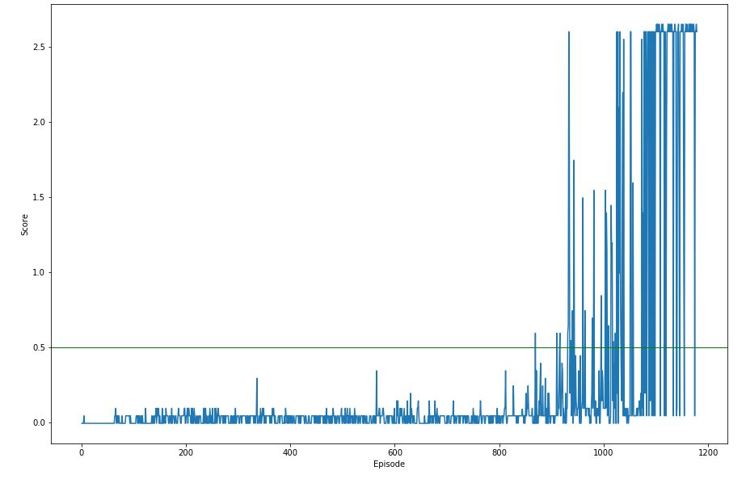

This report documents the course project 'Collaboration and Competition' where you train two agents to control rackets to bounce a ball over a net(play Tennis).

## Problem

In this game of Tennis, if an agent hits the ball over the net, it receives a reward of +0.1. If an agent lets a ball hit the ground or hits the ball out of bounds, it receives a reward of -0.01. Thus, the goal of each agent is to keep the ball in play.

The observation space consists of 8 variables corresponding to the position and velocity of the ball and racket. Each agent receives its own, local observation. Two continuous actions are available, corresponding to movement toward (or away from) the net, and jumping.

The task is episodic, and in order to solve the environment, your agents must get an average score of +0.5 (over 100 consecutive episodes, after taking the maximum over both agents)

## Solution

Based on the provided hints, [Deep Deterministic Policy Gradient(DDPG)](https://arxiv.org/abs/1509.02971) was selected to solve the problem of continous control involving two agents.

### Learning Algorithm

In this project, the same algorithm (i.e. Deep Deterministic Policy Gradient - DDPG) is being used as Project 'Continous Control'. \
DDPG is an actor-critic, model-free algorithm based on the deterministic policy gradient that can operate over continuous action spaces.

In this implementation, there are two neural networks(local and target) each for Actor and Critic. \
Number of hidden layers: 2 \
Hidden Layer 1: 512 units \
Hidden Layer 2: 256 units \
Activation function(both layers): ReLU

Ornstein-Uhlenbeck noise is injected in the action space as per the DDPG paper for better Exploration.

Replay buffer and Soft update are implemented for sample efficiency and stability.

### Plot of Rewards

### Ideas for Future Work

- Change network sizes and choose different hyperparameters
- Trying other algorithms like PPO, A3C or D4PG
- Use parameter space noise rather than noise on action. https://vimeo.com/252185862
- Current our replay buffer is dumb. We can use prioritised experience buffer. https://github.com/Damcy/prioritized-experience-replay
- Different replay buffer for actor/critic
- Try adding dropouts in critic network
